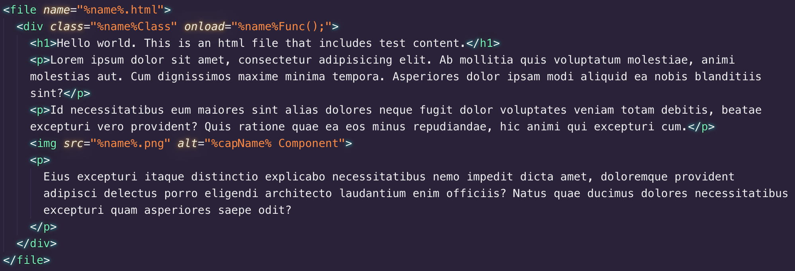
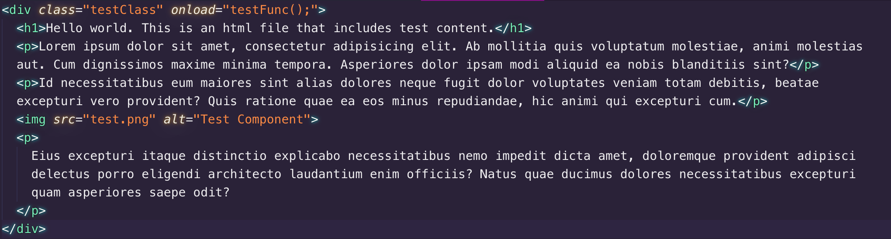

[](https://david-dm.org/tugaybaltaci/generate-structure)
[](https://david-dm.org/tugaybaltaci/generate-structure#info=devDependencies)
[](https://badge.fury.io/js/generate-structure)
[](https://www.npmjs.com/package/code-structure)

# Structure Generator

Structure generator let’s you create multiple code templates/structures to use continuously in your projects.

You can create any code template in any language. You just need to have NodeJS.

**Note**: This repository is still work in progress.

## Install

`npm`

```
npm install generate-structure
```

`yarn`

```
yarn add generate-structure
```

## Usage

There are several ways to use structure generator.

### 1. Javascript (NodeJS)

Javascript way is allows you to change options like `variableTemplate` or initial variables.

```js
const GenerateStructure = require('generate-structure');

// GenerateStructure(name: string, templatePath: string, variables: object, options: object)
const generator = new GenerateStructure("test", "example-templates/test.html", {
  // variables
  foo: 'bar'
}, {
  // options
  variableTemplate: '%var%' // `var` is keyword of variable
});

generator.run();
```

### 2. CLI

If you don't need to change options then you can use CLI tools.

via `npx`

```bash
$ npx generate-structure [name] -t [templatePath]
```

via `yarn`

```bash
$ yarn generate-structure [name] -t [templatePath]
```

via `package.json` scripts

```json
  "scripts": {
    "generate:component": "npx generate-structure -t path/to/template.html"
  }
```

This will allow you to use command like `yarn generate:component component-name` to create template. If you installed this tool in your project, use `yarn` or `npm` instead of `npx`.

#### Using global

```bash
$ yarn global add generate-structure
```

or

```bash
$ npm -g i generate-structure
```

and run

```bash
$ generate-structure -t [path/to/template.html] [name]
```

## Creating Template

Writing template is very simple. You have 3 tags to create a template.

* `structure`
* `file`
* `script`

### What will happend?

| input | output |
| - | - |
|  |  |


### Structure

`structure` tag accepts single attribute for now.
It is `out` attribute which is define root folder of structure. 

```html
<structure out="test/%name%-component">
  ... files, scripts
</structure>
```

### File

`file` tag accepts single attribute which is `name`.
`name` attribute defines file name and you can use variables in.

```html
  <file name="%name%.js">
    function %name%Func() {
      return "test ok"
    }
  </file>

  <file name="%name%.css">
    /* This is a css file */
    .%name%Class {
      /* your css */
    }
  </file>

  <file name="%name%.html">
    <!-- This is an html file. I hope that will be included in output. -->
    <div class="%name%Class" onload="%name%Func();">
      <h1>Hello world.</h1>
      <p>Lorem ipsum dolor sit amet, consectetur adipisicing elit. Ab mollitia quis voluptatum molestiae, animi molestias aut. Cum dignissimos maxime minima tempora. Asperiores dolor ipsam modi aliquid ea nobis blanditiis sint?</p>
      
      <p>
        Eius excepturi itaque distinctio explicabo necessitatibus nemo impedit dicta amet, doloremque provident adipisci delectus porro eligendi architecto laudantium enim officiis? Natus quae ducimus dolores necessitatibus excepturi quam asperiores saepe odit?
      </p>
    </div>
  </file>
```

### Script

`StructureGenerator` has a simple API that let's you create or modify variables with javascript in `script` tag.

**Note**: `type` attribute of `script` tag should be `gs/javascript` to work. Otherwise your scripts don't execute.

`StructureGenerator` object has 3 properties;

| variable | description |
|-|-|
| `name` | Represents file name
| `getVariable` | Brings the variable by given name
| `setVariable` | Defines a variable according to given key and value


```html
  <script type="gs/javascript">
    // These variables can use in everywhere of template including filename.

    const {name, getVariable, setVariable} = StructureGenerator;
    const capName = name.split('-').map(x => x.charAt(0).toUpperCase() + x.slice(1)).join('');

    // Set new variable named `capName`
    setVariable('capName', capName);
  </script>
```

## Dependencies
| package | version | description |
|-|-|-|
| "command-line-args" | ^5.0.2 | For use cli tool, I'm still working on.
| "shelljs" | ^0.8.3 | For creating and modifying files or folders.


